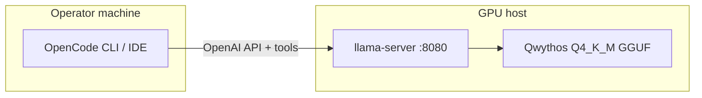

# OpenCode Local Agent — Implementation Roadmap

## Architecture



Optional web chat (not OpenCode): `chat_server.py` proxy on `:8788` → `:8080`.

## Phase 0 — Prerequisites

**Exit criteria:** binaries and weights exist; env vars documented in `.state/opencode_local_agent.json`.

| Step | Action |
|------|--------|
| 0.1 | CUDA driver + `nvidia-smi` OK |
| 0.2 | Build `llama-server` with `-DGGML_CUDA=ON` |
| 0.3 | `hf download` GGUF Q4_K_M (~5.6GB) via `hf-hub` skill |
| 0.4 | (Optional) `HF_TOKEN` for gated models |

## Phase 1 — Long-context llama-server

**Exit criteria:** `/health` OK; `/props` → `n_ctx >= 102400`, `total_slots == 1`.

### Recommended flags (48GB single-user agent)

```bash
-c 102400 \
--parallel 1 \
--flash-attn on \
--cache-type-k q8_0 \
--cache-type-v q8_0 \
-ngl 99 \
--reasoning-preserve
# chat template: use GGUF embedded Qwen3.5 v3 — do NOT pass --chat-template chatml
```

### Why single slot?

llama-server default `n_parallel=4` allocates **four independent KV caches**. For context `C`, VRAM scales roughly as **4×C**. Agent workloads are usually **one session** → set `--parallel 1`.

### VRAM budget (Qwythos 9B Q4, 100k, q8 KV, 1 slot)

| Component | Estimate |
|-----------|----------|
| Weights Q4_K_M | ~6 GB |
| KV q8_0 @ 100k | ~12–18 GB |
| Runtime overhead | ~3–6 GB |
| **Total** | ~22–30 GB / 48 GB |

### OOM ladder

1. `--parallel 1` (mandatory for 100k)
2. `--cache-type-k/v q4_0`
3. `-c 65536`
4. vLLM: `vllm serve ... --max-model-len 102400 --gpu-memory-utilization 0.92 --max-num-seqs 1`

## Phase 2 — API verification

**Exit criteria:** `verify_llm_api.sh` exits 0.

```bash
curl http://127.0.0.1:8080/v1/chat/completions \
  -H 'Content-Type: application/json' \
  -d '{"messages":[{"role":"user","content":"ping"}],"max_tokens":32,"temperature":0.6,"top_p":0.95,"top_k":20}'
```

Check `/props` for slot count and context.

## Phase 3 — OpenCode wiring

**Exit criteria:** `opencode.json` in project root; OpenCode lists local model.

1. Install OpenCode: https://opencode.ai/docs/
2. Run `setup_opencode_config.sh "$WORK_DIR"`
3. Set `baseURL`:
   - Same machine: `http://127.0.0.1:8080/v1`
   - Remote GPU via AutoDL: `https://<mapped-host>/v1` (map 8080 or use 8788 proxy — update proxy to forward `/v1/*` only)
4. `cd "$WORK_DIR" && opencode`
5. Select model `local-llm/qwythos-q4`

### opencode.json shape

See [../templates/opencode.json](../templates/opencode.json).

## Phase 4 — Agent smoke test

**Exit criteria:** `verify_opencode_agent.sh` exits 0.

### Headless / CI (AutoDL, nohup, Cursor agent shell)

Plain `opencode run` **hangs after `init`** when stdout is not a TTY (timeout exit 124/143). Use the bundled verifier:

```bash
bash scripts/verify_opencode_agent.sh "$WORK_DIR"
```

It runs:

```bash
script -q -c 'opencode run --pure --dangerously-skip-permissions --format json -m local-llm/qwythos-q4 "Reply with exactly: ok"' /dev/null
```

Flags:
- `script` — pseudo-TTY so OpenCode init completes
- `--pure` — skip external plugins
- `--dangerously-skip-permissions` — no interactive approve prompts
- `--format json` — parse assistant text from event stream

### Interactive

```bash
cd "$WORK_DIR" && opencode
```

Suggested prompt: Read `README.md` and list three key commands.

## Phase 5 — Production habits

| Concern | Practice |
|---------|----------|
| Process lifetime | `nohup` + log to `.state/llama_server.log` |
| Restarts | Document `start_llama_server.sh` in workspace README |
| HARP integration | Record deploy in `skill_usage_ledger.jsonl`; do not replace HARP webchat |
| Security | No public 8080 without tunnel; fine-grained tokens for Hub only |
| Quality | `temperature=0.6, top_p=0.95, top_k=20` |

## Phase 6 — Multimodal (optional)

**Exit criteria:** `verify_vision_api.sh` exits 0; web UI shows vision enabled.

See [multimodal.md](./multimodal.md) for download, `--mmproj`, API shape, and `:8788` web chat.

Quick path:

```bash
bash scripts/download_mmproj.sh
# restart llama-server (see Phase 1)
bash scripts/verify_vision_api.sh
# qwythos-local: nohup bash start_chat_ui.sh → :8788 with 🖼 upload
```

## Future skill enhancements (not required for v1)

- [ ] **Upstream issue 待提:** `opencode run` hangs without TTY — draft in [upstream_issue_opencode_headless_tty.md](./upstream_issue_opencode_headless_tty.md); file at https://github.com/anomalyco/opencode/issues when ready
- [ ] vLLM backend switch in `start_llm_backend.sh`
- [ ] systemd unit template for persistent serve
- [ ] AutoDL port-mapping helper
- [ ] Thinking-block stripper for OpenCode display
- [ ] Seed into `experiment_on_silicon` default set after team validation

## HARP verifier path (planned)

Use OpenCode + local Qwythos for **bounded verification** inside HARP missions — not as the main planner/executor brain.

| Task type | Example | Why local OpenCode |
|-----------|---------|-------------------|
| Artifact gate | "Does `manifest.json` list all required files?" | Cheap, offline, no cloud token |
| Command sanity | "Run `python scripts/lint.py` and summarize exit code" | Tool loop already built into OpenCode |
| Fact check | "Read `results.csv` and confirm row count matches claim" | 100k ctx fits full artifact tree |

Integration sketch:

1. HARP executor detects `verifier` sub-task in plan (filesystem / shell / JSON only).
2. Spawn `opencode run --model local-llm/qwythos-q4` with read-only workspace mount.
3. Write result to `.state/verifier_<task_id>.json`; main executor consumes pass/fail.

Keep main HARP agent on cloud model; local model only for **mechanical checks** where latency and cost matter less than correctness of file/command operations.

## Canonical vs HARP seed copy

| Location | Role |
|----------|------|
| `TAOYUZHOU/skills/skills/opencode-local-agent/` | **Canonical** — edit here |
| `harness-auto-research/skill/skills_seed/experiment_on_silicon/opencode-local-agent/` | HARP engine mirror for workspace seed |
| `WORK_DIR/.cursor/skills/opencode-local-agent/` | Runtime copy after `init_workspace.sh` |

Domain placement: `experiment_on_silicon` because GPU serve + local inference; personal skills repo has no domain folders.

## Upstream — OpenCode headless TTY hang

**Status:** 待提 (draft ready, not filed)

| Item | Detail |
|------|--------|
| Repo | [anomalyco/opencode](https://github.com/anomalyco/opencode) (MIT) |
| Symptom | `opencode run` blocks after `init` when stdout is not a TTY |
| Workaround | `script -q -c 'opencode run ...' /dev/null` — see `verify_opencode_agent.sh` |
| Issue draft | [upstream_issue_opencode_headless_tty.md](./upstream_issue_opencode_headless_tty.md) |

After upstream fixes, simplify `verify_opencode_agent.sh` to call bare `opencode run` and drop the `script` wrapper.
